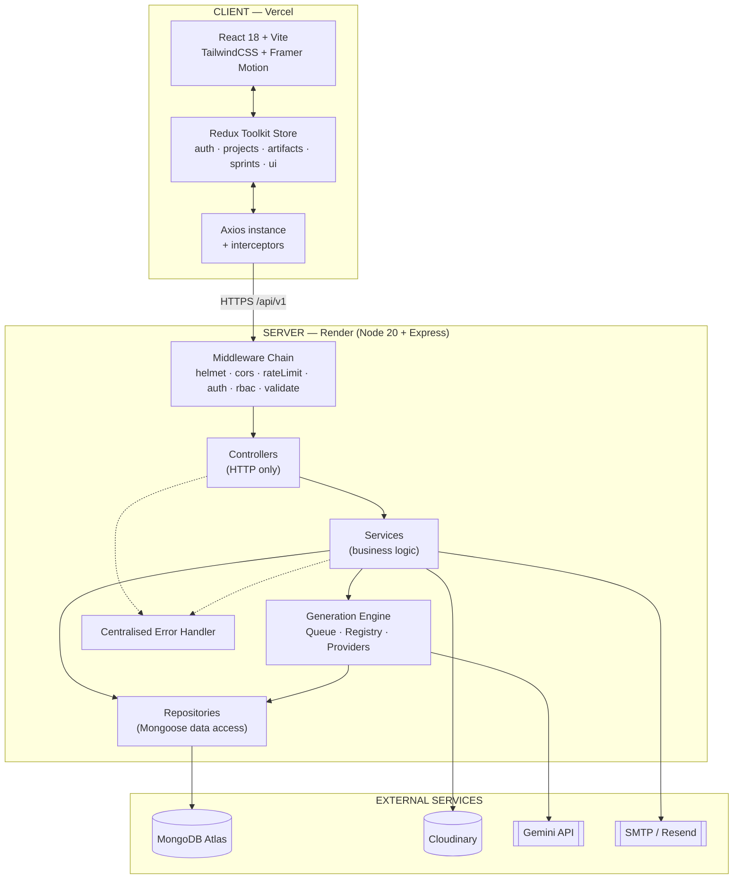
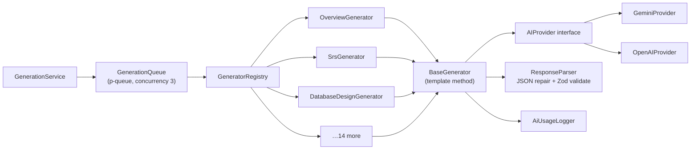
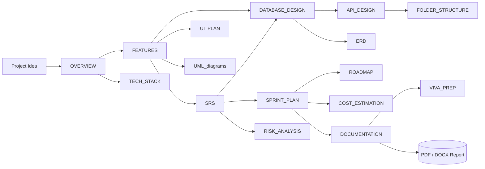
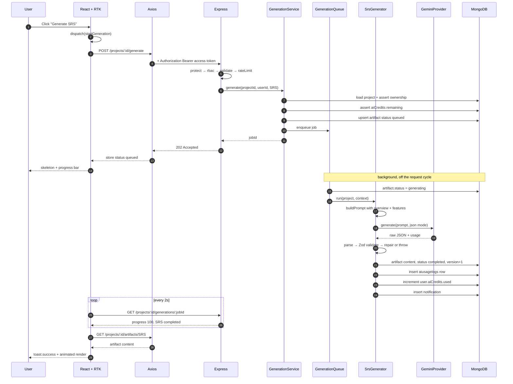
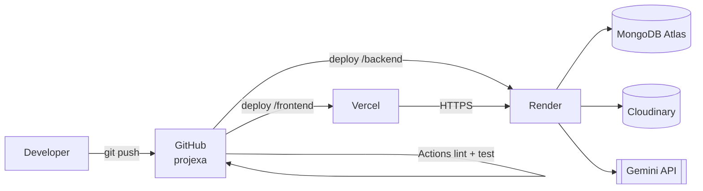

# Projexa — 01. Architecture & Technology Stack

> **Phase 1 · Document 1 of 7**
> Everything in this document is a *decision record*. Later phases implement it literally.

---

## 1. Product Definition

**Projexa** is a SaaS platform that converts a one-line project idea into a complete, exportable SDLC package.

| Aspect | Definition |
|---|---|
| **Input** | A structured "Project Idea" (title, description, domain, difficulty, team size, preferred tech, deadline, AI-required flag) |
| **Process** | 17 independent AI generator modules run against that idea |
| **Output** | Persisted, editable, versioned artifacts + rendered diagrams + a downloadable PDF/DOCX report |
| **Users** | Student (primary), Mentor/Faculty (reviewer), Admin (operator) |

### 1.1 The Central Architectural Insight

The product is **not** 20 unrelated features. It is **one pipeline executed 17 times with different prompts and different output shapes**.

```
Project (input)  ──▶  Generator (strategy)  ──▶  Artifact (output)
```

Every one of Modules 3–20 fits this shape. Therefore we build **one** generation engine and **17 thin strategy classes**, not 17 controllers. This single decision is what makes the codebase scalable and is the direct application of the Open/Closed Principle: *adding Module 21 requires zero changes to existing code — only a new file and one registry entry.*

### 1.2 Module → Artifact Type Mapping

This enum is the contract shared by backend, frontend and database. It is defined **once** in `shared/constants/artifactTypes.js` and mirrored on the client.

| # | Module | `artifactType` | Storage |
|---|---|---|---|
| 3 | Project Analysis / Overview | `OVERVIEW` | `artifacts` |
| 3b | Suggested Features | `FEATURES` | `artifacts` |
| 4 | SRS (Functional + Non-Functional) | `SRS` | `artifacts` |
| 5 | AI Database Designer | `DATABASE_DESIGN` | `artifacts` |
| 6 | AI API Generator | `API_DESIGN` | `artifacts` |
| 7 | Folder Structure Generator | `FOLDER_STRUCTURE` | `artifacts` |
| 8 | AI UI Planner | `UI_PLAN` | `artifacts` |
| 9 | Sprint Planner | `SPRINT_PLAN` | `artifacts` → materialised into `sprints` + `tasks` |
| 10 | Documentation Generator | `DOCUMENTATION` | `artifacts` |
| 11 | Viva Preparation | `VIVA_PREP` | `artifacts` |
| 12 | ER Diagram | `ERD` | `diagrams` |
| 13 | UML Diagrams | `UML_USECASE`, `UML_CLASS`, `UML_SEQUENCE`, `UML_ACTIVITY` | `diagrams` |
| 14 | Cost Estimation | `COST_ESTIMATION` | `artifacts` |
| 15 | Risk Analysis | `RISK_ANALYSIS` | `artifacts` |
| 16 | Tech Stack Recommendation | `TECH_STACK` | `artifacts` |
| 17 | Roadmap Generator | `ROADMAP` | `artifacts` |
| 18 | Project Report | — | `reports` (composed from artifacts, not AI-generated) |
| 19 | GitHub Assistant | `GITHUB_GUIDE` | `artifacts` |
| 20 | Deployment Guide | `DEPLOYMENT_GUIDE` | `artifacts` |

**Why `diagrams` is a separate collection from `artifacts`:** diagrams carry two extra concerns artifacts do not — a *source language* (Mermaid/Graphviz) and a *rendered binary* hosted on Cloudinary. Forcing them into `artifacts` would mean nullable fields and type-checking in every consumer. Separating them keeps both models cohesive (Single Responsibility at the data layer).

**Why `sprints`/`tasks` are separate:** the sprint plan is the only AI output the user *mutates continuously* (checking off tasks, reordering, reassigning). Mutable, queryable, per-row data belongs in its own collection; storing it as a JSON blob inside an artifact would force a full-document rewrite on every checkbox click.

---

## 2. Technology Stack

### 2.1 Frontend

| Technology | Version target | Why this, specifically |
|---|---|---|
| **React 18** | `^18.3` | Concurrent rendering; the artifact viewer renders large trees and benefits from `useTransition` when switching modules. |
| **Vite 5** | `^5.4` | Native ESM dev server, sub-second HMR. CRA is deprecated. First-class Vercel support. |
| **TailwindCSS 3** | `^3.4` | Utility-first keeps styling colocated with components; no CSS file sprawl across 60+ components. Design tokens live in `tailwind.config.js` (see Doc 06). |
| **Redux Toolkit** | `^2.2` | Generation state is *global and long-lived* — a job started on the Overview tab must update a badge in the sidebar. Prop drilling or Context would not survive this. RTK gives us `createAsyncThunk`, Immer, and DevTools time-travel. |
| **React Router 6** | `^6.26` | Data routers + nested layouts map cleanly onto our role-based dashboards. |
| **Axios** | `^1.7` | Interceptors are non-negotiable: attach access token, transparently refresh on 401, normalise error envelopes. `fetch` would require hand-rolling this. |
| **Framer Motion** | `^11.3` | Generation is slow (5–30s). Motion carries perceived-performance work: skeleton shimmer, staggered artifact reveal, page transitions. |
| **React Hook Form** | `^7.52` | Uncontrolled inputs → the 8-field Project Idea form re-renders once, not per keystroke. Pairs with the Zod resolver for a schema shared with backend validators. |
| **React Hot Toast** | `^2.4` | Non-blocking feedback for async job completion. |
| **Zod** | `^3.23` | One schema definition reused by RHF (client) and our validators (server). Single source of truth. |
| **Mermaid** | `^11.0` | Renders ERD/UML client-side instantly; server-side rendering only when exporting. |
| **Recharts** | `^2.12` | Admin analytics + student progress rings. |

### 2.2 Backend

| Technology | Version target | Why this, specifically |
|---|---|---|
| **Node.js 20 LTS** | `20.x` | Native `fetch`, stable ESM, matches Render's default runtime. |
| **Express 4** | `^4.19` | Mature middleware ecosystem; our layered architecture treats Express as a *thin delivery mechanism* only. |
| **MongoDB Atlas** | `7.x` | AI outputs are heterogeneous, deeply nested, and schema-evolving (an SRS is nothing like a cost estimate). A document store is the correct fit; forcing this into SQL would mean 17 tables or a JSON column anyway. |
| **Mongoose 8** | `^8.5` | Schema validation, discriminators, lean queries, populate, middleware hooks for slugs and password hashing. |
| **jsonwebtoken** | `^9.0` | Stateless access tokens (15 min) + rotating refresh tokens (7 days) persisted in `refreshtokens`. |
| **bcryptjs** | `^2.4` | Password hashing, cost factor 12. `bcryptjs` over `bcrypt` avoids native build failures on Render's free tier. |
| **Multer** | `^1.4.5-lts.1` | `memoryStorage` only — files go buffer → Cloudinary stream. We never write to the container disk, because Render's filesystem is ephemeral. |
| **Cloudinary** | `^2.4` | Avatars, project covers, rendered diagram PNGs, exported PDF/DOCX reports. |
| **@google/generative-ai** | `^0.21` | Gemini SDK. Wrapped behind our own provider interface (§5.2) so OpenAI can be swapped in without touching generators. |
| **express-validator** | `^7.1` | Request validation at the middleware boundary. |
| **helmet / cors / express-rate-limit / express-mongo-sanitize / hpp** | latest | Standard hardening set. |
| **winston + morgan** | `^3.14` / `^1.10` | Structured logs; required for the admin AI-usage dashboard. |
| **compression / cookie-parser / dotenv** | latest | Infrastructure basics. |
| **puppeteer-core + @sparticuz/chromium** | — | HTML→PDF report export on Render. |
| **docx** | `^8.5` | DOCX report export. |
| **p-queue** | `^8.0` | In-process concurrency-limited generation queue (see §5.3). |

### 2.3 Platform

| Concern | Choice | Notes |
|---|---|---|
| Frontend hosting | **Vercel** | Auto-deploy from `main`, preview deploys per PR. |
| Backend hosting | **Render** | Web Service, Node 20, health check at `/api/v1/health`. |
| Database | **MongoDB Atlas M0** | Free tier is sufficient for FYP scale. |
| Object storage | **Cloudinary** | Free tier: 25 GB storage / 25 GB bandwidth. |
| Version control | **GitHub** | Monorepo, two top-level workspaces. Conventional Commits. |
| CI | **GitHub Actions** | Lint + test on PR. |

---

## 3. High-Level System Architecture



---

## 4. Backend Layered Architecture

We use **MVC as the file organisation** and **Clean Architecture as the dependency rule**. These are complementary, not competing: MVC tells us *where files live*, Clean Architecture tells us *which direction imports may point*.

### 4.1 The Dependency Rule

```
Route  →  Middleware  →  Controller  →  Service  →  Repository  →  Model  →  MongoDB
                                           ↓
                                    Generation Engine  →  AI Provider
```

**Imports may only point rightward.** A service never imports `req`/`res`. A repository never imports a service. This is enforced by ESLint `no-restricted-imports` (configured in Phase 2).

### 4.2 Responsibility of Each Layer

| Layer | Owns | Must NOT do |
|---|---|---|
| **Route** | URL → middleware chain → controller binding. Nothing else. | No logic, no `try/catch`, no DB access. |
| **Middleware** | Authentication, authorisation, validation, rate limiting, file parsing. | No business rules. |
| **Controller** | Read `req`, call **one** service method, shape the HTTP response with `ApiResponse`. | No `Model.find()`, no business branching, no `try/catch` (handled by `asyncHandler`). |
| **Service** | All business logic, orchestration, transactions, authorisation *rules* (ownership checks), throwing `ApiError`. | No knowledge of HTTP. Pure in/out. |
| **Repository** | Mongoose queries, projections, pagination, index-aware lookups. | No business decisions. |
| **Model** | Schema, field-level validation, indexes, virtuals, document methods. | No cross-collection orchestration. |

### 4.3 Request Lifecycle (concrete)

`PATCH /api/v1/projects/:id`

```
1.  helmet, cors, compression, json body parser, mongoSanitize
2.  apiLimiter                        → 429 if exceeded
3.  protect                           → verifies JWT, attaches req.user, else 401
4.  validate(updateProjectValidator)  → 422 with field errors if invalid
5.  projectController.updateProject   → wrapped in asyncHandler
6.    ↳ projectService.update(id, userId, dto)
7.        ↳ projectRepository.findById(id)      → 404 if null
8.        ↳ ownership guard                     → 403 if not owner/mentor
9.        ↳ markDependentArtifactsStale(id)     → sets isStale = true
10.       ↳ projectRepository.update(id, dto)
11.   ↳ res.status(200).json(new ApiResponse(200, project, "Project updated"))
12. errorHandler (only if any layer threw)
```

Step 9 is a real business rule and is exactly why it must live in the service: **if the user edits the project idea, every previously generated artifact is now out of date.** We flag them `isStale` rather than deleting, so the UI can show "Regenerate — your idea changed" without destroying the user's work.

---

## 5. AI Generation Subsystem

This is the heart of the product and gets the most design attention.

### 5.1 Component Diagram



### 5.2 Provider Abstraction — Dependency Inversion

The generators depend on an **interface**, never on Gemini.

```
services/ai/providers/
├── AIProvider.js          # abstract: generate(prompt, options) → { text, usage }
├── GeminiProvider.js      # implements AIProvider using @google/generative-ai
├── OpenAIProvider.js      # implements AIProvider using the openai SDK
└── providerFactory.js     # returns a provider based on env AI_PROVIDER
```

**Why this matters practically, not just theoretically:** Gemini free-tier quotas are aggressive. When you hit the daily cap mid-demo, you change one environment variable (`AI_PROVIDER=openai`) and the entire application keeps working. No generator file is touched.

### 5.3 Queue Strategy — and why not BullMQ (yet)

Generating all 17 modules takes 60–180 seconds. A synchronous HTTP request would time out on Render (100s limit) and behind Vercel's proxy.

**Chosen approach for Phases 1–6: asynchronous job with status polling.**

```
POST /api/v1/projects/:id/generate           →  202 Accepted  { jobId }
        (artifacts created with status = "queued")
GET  /api/v1/projects/:id/generations/:jobId →  200 { progress, modules[] }
        (frontend polls every 2s, or subscribes via SSE)
```

Work runs in-process through `p-queue` with `concurrency: 3`, so we respect Gemini rate limits and never block the event loop with unbounded parallel calls. Each artifact row is its own state machine (`queued → generating → completed | failed`), so a single module failing never fails the batch, and the user can retry just that one.

**Trade-off, stated honestly:** in-process means a server restart loses in-flight jobs. Mitigation: artifacts stuck in `generating` for more than 5 minutes are swept back to `failed` by a startup reconciliation routine, so the UI is never permanently wrong. **Scale path:** swap `p-queue` for **BullMQ + Redis** — this changes exactly one file (`GenerationQueue.js`) because everything else depends on the queue's interface, not its implementation.

### 5.4 Prompt Architecture

Prompts are **data, not code**. They live in `services/ai/prompts/` as versioned template modules:

```
prompts/
├── system/basePersona.js       # "You are a senior software architect…"
├── modules/overview.prompt.js
├── modules/srs.prompt.js
└── … one per artifact type
```

Each prompt module exports `{ version, buildPrompt(project, context), outputSchema }`.

Three rules every prompt follows:

1. **Structured output.** Every prompt demands strict JSON and supplies the exact key list. We set Gemini's `responseMimeType: "application/json"`.
2. **Zod-validated.** `outputSchema` validates the parsed response. A malformed AI response becomes a clean `failed` artifact with a retry button — never a crash, never corrupt data in Mongo.
3. **Context chaining.** Later modules receive earlier outputs. `API_DESIGN` is generated *with the `DATABASE_DESIGN` output injected into its prompt*, so the endpoints actually match the collections. This dependency graph is declared in each generator's `dependsOn` array and topologically sorted by the queue.



### 5.5 Cost & Abuse Control

| Control | Mechanism |
|---|---|
| Per-user quota | `user.aiCredits.used / limit`, checked in `GenerationService` before enqueue → `429` |
| Per-endpoint rate limit | `express-rate-limit`: 10 generation requests / hour / user |
| Token accounting | Every call writes an `aiusagelogs` row (tokens, latency, cost, status) |
| Caching | An identical `(projectHash, artifactType, promptVersion)` returns the cached artifact instead of re-calling the API |
| Admin visibility | `/api/v1/admin/ai-usage` aggregates the log collection |

---

## 6. End-to-End Data Flow

Scenario: *a student generates the SRS for an existing project.*



---

## 7. SOLID Principles — Where Each One Actually Lives

Not a checklist. Each row names the concrete file where the principle is enforced.

| Principle | Applied in this codebase |
|---|---|
| **S** — Single Responsibility | `artifactController.js` only translates HTTP. `artifactService.js` only holds rules. `artifactRepository.js` only queries. `SrsGenerator.js` only knows how to produce one SRS. A change to SRS prompting touches exactly one file. |
| **O** — Open/Closed | `GeneratorRegistry` maps `artifactType → generator`. Adding Module 21 = create `NewGenerator.js` + register it. Zero edits to the engine, controller, service, or queue. |
| **L** — Liskov Substitution | `GeminiProvider` and `OpenAIProvider` both satisfy `AIProvider`. `GenerationService` cannot tell them apart. Likewise `PdfExporter` / `DocxExporter` behind `ReportExporter`. |
| **I** — Interface Segregation | Repositories are split per aggregate (`projectRepository`, `artifactRepository`, `sprintRepository`) rather than one god `dbService`. Frontend hooks are narrow: `useProject`, `useGenerationStatus`, `useArtifact` — no component imports capability it doesn't use. |
| **D** — Dependency Inversion | High-level `GenerationService` depends on the `AIProvider` and `Queue` abstractions, never on `@google/generative-ai` or `p-queue` directly. Concrete classes are injected by `providerFactory` / `container.js`. This is also what makes services unit-testable with mocks. |

**Additional patterns in use:** Strategy (generators), Template Method (`BaseGenerator.run()` fixes the algorithm: build → call → parse → validate → persist → log), Factory (`providerFactory`), Repository (data access), Adapter (Cloudinary wrapper), Facade (`projectService` fronting several repositories), Chain of Responsibility (Express middleware).

---

## 8. Cross-Cutting Concerns

### 8.1 Authentication & Authorisation

| Concern | Decision |
|---|---|
| Access token | JWT, **15 min**, `Authorization: Bearer`, held in Redux memory only |
| Refresh token | JWT, **7 days**, `httpOnly` + `secure` + `sameSite=none` cookie, persisted & rotated in `refreshtokens` |
| Rotation | Every refresh issues a new token and revokes the old one; reuse of a revoked token revokes the whole family (theft detection) |
| Password | bcrypt, cost 12, hashed in a Mongoose `pre('save')` hook so it can never be bypassed |
| RBAC | `authorize('admin','mentor')` middleware for role gates; ownership checks live in services because they need the document |
| Email verification | Hashed one-time token, 24h expiry |

**Why memory + httpOnly cookie rather than `localStorage`:** `localStorage` is readable by any injected script, making XSS an immediate full account takeover. The access token in memory dies on refresh (recovered silently via the cookie); the refresh token in an `httpOnly` cookie is unreadable by JavaScript. CSRF is mitigated by `sameSite` plus the fact that the refresh endpoint is the only cookie-authenticated route.

### 8.2 Centralised Error Handling

Every async controller is wrapped in `asyncHandler`, so no `try/catch` appears in controllers. All errors converge on one `errorHandler` middleware that normalises Mongoose `CastError` / `ValidationError` / duplicate-key (11000), JWT errors, Multer errors and Cloudinary errors into a single envelope:

```json
{
  "success": false,
  "statusCode": 422,
  "message": "Validation failed",
  "errors": [{ "field": "email", "message": "Email is not valid" }],
  "requestId": "8f2c…",
  "stack": "development only"
}
```

Operational errors (`ApiError`) are returned to the client; unexpected errors are logged by Winston and returned as a generic 500 so internals never leak.

### 8.3 Other Concerns

| Concern | Decision |
|---|---|
| API versioning | All routes under `/api/v1`. Breaking changes → `/api/v2`, both mounted simultaneously. |
| Logging | Winston (JSON, level by env) + Morgan piped into Winston. `requestId` (UUID) on every request, echoed in error responses for support. |
| Validation | Boundary-only, via `express-validator`, mirrored on the client by Zod. Never validate in services. |
| Config | `config/env.js` reads and **validates** all env vars at boot with Zod; the process exits immediately on a missing variable rather than failing at 3am on the first request. |
| Soft delete | `projects` use `isDeleted` + a global query filter; a 30-day restore window. |
| Pagination | Offset pagination with a `meta` block on every list response. |
| Health check | `GET /api/v1/health` reports uptime, DB connection state, AI provider reachability. Consumed by Render. |
| Testing | Jest + Supertest (backend, `mongodb-memory-server`), Vitest + Testing Library (frontend). |

---

## 9. Deployment Topology



| Environment | Client | Server | Database |
|---|---|---|---|
| Local | `localhost:5173` | `localhost:8000` | local `mongod` or Atlas dev cluster |
| Preview | Vercel preview URL | Render preview service | Atlas `staging` DB |
| Production | Vercel production | Render production | Atlas `production` DB |

**Known operational note:** Render's free tier sleeps after 15 minutes of inactivity, so the first request after idle takes ~50s. Mitigation for demo day: an external cron pings `/api/v1/health` every 10 minutes, and the client shows an explicit "waking the server" state rather than a spinner that looks broken.

---

**Next:** [02 — Folder Structure](./02-folder-structure.md)
