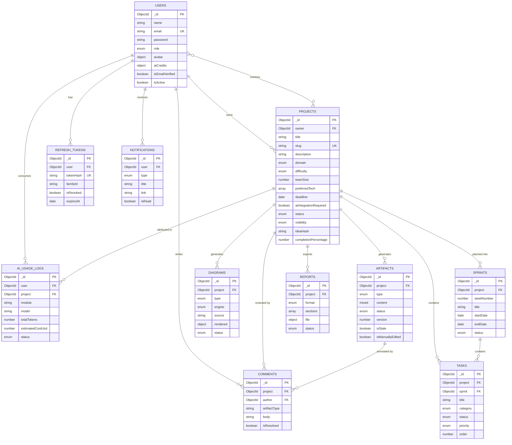

# Projexa — 03. Database Schema

> **Phase 1 · Document 3 of 7**
> MongoDB 7 + Mongoose 8. Eleven collections. Every field, index and relationship is final for Phase 2.

---

## 1. Entity Relationship Diagram



---

## 2. Collection: `users`

Represents every human in the system. One collection with a `role` discriminator rather than three collections, because 90% of the fields are shared and cross-role queries (admin listing everyone) stay trivial.

| Field | Type | Constraints | Notes |
|---|---|---|---|
| `_id` | ObjectId | PK | |
| `name` | String | required, trim, 2–60 | |
| `email` | String | required, **unique**, lowercase, trim, valid email | Login identity |
| `password` | String | required, min 8, `select: false` | bcrypt cost 12, hashed in `pre('save')` |
| `role` | String | enum `student` \| `mentor` \| `admin`, default `student` | Drives RBAC |
| `avatar` | Object | `{ url, publicId }` | Cloudinary; `publicId` needed to destroy the old file on replace |
| `bio` | String | max 500 | |
| `college` | String | max 120 | |
| `branch` | String | max 80 | e.g. "Computer Science" |
| `graduationYear` | Number | 2000–2100 | |
| `skills` | [String] | max 20 items | Feeds tech-stack prompts |
| `github` | String | URL | Used by the GitHub Assistant module |
| `linkedin` | String | URL | |
| `aiCredits` | Object | `{ used: Number=0, limit: Number=200, resetAt: Date }` | Monthly quota |
| `isEmailVerified` | Boolean | default `false` | |
| `emailVerificationToken` | String | `select: false` | SHA-256 hash of the emailed token |
| `emailVerificationExpires` | Date | `select: false` | |
| `passwordResetToken` | String | `select: false` | SHA-256 hash |
| `passwordResetExpires` | Date | `select: false` | |
| `passwordChangedAt` | Date | | Invalidates JWTs issued before a password change |
| `isActive` | Boolean | default `true` | Admin soft-ban |
| `lastLoginAt` | Date | | |
| `preferences` | Object | `{ theme: 'system', emailNotifications: true }` | |
| `createdAt` / `updatedAt` | Date | `timestamps: true` | |

**Indexes**

```js
{ email: 1 }                              // unique
{ role: 1, isActive: 1 }                  // admin user table
{ createdAt: -1 }                         // growth analytics
{ emailVerificationToken: 1 }             // sparse
{ passwordResetToken: 1 }                 // sparse
```

**Document methods:** `comparePassword(plain)`, `generateEmailVerificationToken()`, `generatePasswordResetToken()`, `hasCreditsRemaining()`, `changedPasswordAfter(jwtIat)`
**Virtuals:** `projectCount` (populate-on-demand), `initials`

**Why store only the SHA-256 hash of email/reset tokens:** if the database leaks, raw reset tokens would let an attacker take over every account with a pending reset. We email the plaintext token once and store only its hash — exactly the same reasoning as password hashing.

---

## 3. Collection: `projects`

The root aggregate. Everything else in the system hangs off a project.

| Field | Type | Constraints | Notes |
|---|---|---|---|
| `_id` | ObjectId | PK | |
| `owner` | ObjectId → `User` | required, indexed | |
| `mentors` | [ObjectId → `User`] | default `[]` | Faculty granted review access |
| `title` | String | required, trim, 5–120 | Module 2 input |
| `slug` | String | unique, auto from title + nanoid | Shareable public URLs |
| `description` | String | required, 20–2000 | Module 2 input — the core prompt material |
| `domain` | String | enum, required | `healthcare` \| `education` \| `finance` \| `ecommerce` \| `social` \| `iot` \| `agriculture` \| `transport` \| `entertainment` \| `security` \| `productivity` \| `other` |
| `difficulty` | String | enum `beginner` \| `intermediate` \| `advanced` \| `expert` | Module 2 input |
| `teamSize` | Number | 1–20, default 1 | Drives sprint + cost estimation |
| `preferredTech` | [String] | max 25 | Empty ⇒ Module 16 recommends a stack |
| `deadline` | Date | must be future on create | Drives sprint week count |
| `aiIntegrationRequired` | Boolean | default `false` | |
| `projectType` | String | enum `web` \| `mobile` \| `desktop` \| `ml` \| `data` \| `embedded` \| `other` | |
| `coverImage` | Object | `{ url, publicId }` | Cloudinary |
| `tags` | [String] | max 15, lowercase | Explore-page filtering |
| `status` | String | enum `draft` \| `generating` \| `ready` \| `in_progress` \| `completed` \| `archived`, default `draft` | Lifecycle |
| `visibility` | String | enum `private` \| `unlisted` \| `public`, default `private` | |
| `ideaHash` | String | SHA-256 of the normalised idea fields | **Cache key + staleness detector** |
| `generatedModules` | [String] | subset of `ARTIFACT_TYPES` | Denormalised for fast dashboard rendering |
| `completionPercentage` | Number | 0–100, default 0 | Derived from completed tasks |
| `bookmarkedBy` | [ObjectId → `User`] | | Explore-page saves |
| `viewCount` | Number | default 0 | |
| `lastGeneratedAt` | Date | | |
| `isDeleted` | Boolean | default `false`, indexed | Soft delete |
| `deletedAt` | Date | | Hard-purged after 30 days by a cron job |
| `createdAt` / `updatedAt` | Date | `timestamps: true` | |

**Indexes**

```js
{ owner: 1, isDeleted: 1, createdAt: -1 }     // the dashboard's primary query — compound, order matters
{ slug: 1 }                                    // unique
{ visibility: 1, isDeleted: 1, viewCount: -1 } // explore page
{ mentors: 1 }                                 // mentor dashboard
{ ideaHash: 1 }                                // generation cache lookup
{ title: 'text', description: 'text', tags: 'text' }  // search
```

**Middleware:** `pre('save')` generates the slug and recomputes `ideaHash`; `pre(/^find/)` applies `{ isDeleted: false }` unless explicitly overridden.

**Why `ideaHash` is worth a field of its own.** It is computed from `title + description + domain + difficulty + teamSize + preferredTech + aiIntegrationRequired`. It buys two things with one value:

1. **Staleness detection.** If the stored hash differs from the recomputed hash after an edit, every artifact is flagged `isStale = true` and the UI shows a "your idea changed — regenerate" banner. Without this we would either silently serve outdated documents or destructively wipe the user's work on every keystroke.
2. **Cache hits.** Two users describing the same idea, or one user regenerating without changing anything, hit `(ideaHash, artifactType, promptVersion)` and skip the API call entirely. On a free Gemini tier this is the difference between a working demo and a quota error.

---

## 4. Collection: `artifacts`

One document per (project, artifactType). This is where 15 of the 20 modules land.

| Field | Type | Constraints | Notes |
|---|---|---|---|
| `_id` | ObjectId | PK | |
| `project` | ObjectId → `Project` | required, indexed | |
| `type` | String | enum `ARTIFACT_TYPES`, required | See Doc 01 §1.2 |
| `content` | Mixed | | Shape depends on `type`; validated by that generator's Zod schema before write |
| `status` | String | enum `queued` \| `generating` \| `completed` \| `failed`, default `queued` | Per-module state machine |
| `version` | Number | default 1 | Incremented on every regeneration |
| `previousVersions` | [Object] | `{ version, content, generatedAt }`, capped at 5 | Version history + restore |
| `isStale` | Boolean | default `false` | Set when the parent idea changes |
| `isManuallyEdited` | Boolean | default `false` | User edited AI output — warn before overwriting |
| `promptVersion` | String | | Cache invalidation when we improve a prompt |
| `model` | String | e.g. `gemini-1.5-flash` | |
| `generationMeta` | Object | `{ promptTokens, completionTokens, latencyMs, attempts }` | |
| `error` | Object | `{ message, code, occurredAt }` | Populated only when `status: 'failed'` |
| `jobId` | String | indexed | Groups a batch generation run |
| `generatedAt` | Date | | |
| `createdAt` / `updatedAt` | Date | `timestamps: true` | |

**Indexes**

```js
{ project: 1, type: 1 }        // UNIQUE — one live artifact per type per project
{ project: 1, status: 1 }
{ jobId: 1 }                   // job status endpoint
{ status: 1, updatedAt: 1 }    // stuck-job reconciliation sweep
```

**Why `content` is `Mixed` and not a strict schema.** An `SRS` is `{ functional[], nonFunctional[] }`; a `COST_ESTIMATION` is `{ developmentTime, hosting, domain, apiUsage, team[] }`. Modelling 17 mutually exclusive shapes in one Mongoose schema means 17 optional sub-objects, and Mongoose cannot validate "exactly one of these is present". We therefore validate at the **application boundary** with the generator's Zod `outputSchema` — which is stricter than Mongoose would be, gives better error messages, and keeps the model file readable. Mongoose is our storage layer, not our type system.

### 4.1 `content` Shapes per Type (the generator contracts)

```js
OVERVIEW          { objective, scope, targetUsers[], realWorldProblem, expectedOutcome, keyBenefits[] }
FEATURES          { roles: [{ role, features: [{ name, description, priority }] }] }
SRS               { functional: [{ id, title, description, priority }],
                    nonFunctional: [{ category, requirement, metric }] }
DATABASE_DESIGN   { collections: [{ name, purpose, fields: [{ name, type, required, description }] }],
                    relationships: [{ from, to, type, description }] }
API_DESIGN        { groups: [{ resource, endpoints: [{ method, path, auth, description,
                                                        requestExample, responseExample, statusCodes[] }] }] }
FOLDER_STRUCTURE  { frontend: <TreeNode>, backend: <TreeNode>, conventions[] }
                  // TreeNode = { name, type: 'file'|'folder', purpose, children[] }
UI_PLAN           { pages: [{ name, route, purpose, components[] }],
                    navigation: { primary[], secondary[] },
                    forms: [{ name, fields[] }],
                    colorPalette: { primary, secondary, accent, neutral, semantic{} },
                    typography: { heading, body },
                    responsive: { breakpoints{}, recommendations[] } }
SPRINT_PLAN       { totalWeeks, sprints: [{ weekNumber, title, goal,
                                            tasks: [{ title, description, category, estimatedHours }] }] }
DOCUMENTATION     { abstract, introduction, objectives[], existingSystem, proposedSystem,
                    advantages[], futureScope[], conclusion }
VIVA_PREP         { technical: [{ q, a, difficulty }], conceptual: [...], projectSpecific: [...], hr: [...] }
COST_ESTIMATION   { developmentTime: { weeks, personHours },
                    hosting: [{ service, tier, monthlyUsd }],
                    domain: { registrar, annualUsd },
                    apiUsage: [{ api, estimatedCalls, monthlyUsd }],
                    team: [{ role, count, justification }],
                    totalMonthlyUsd, totalOneTimeUsd, currencyNote }
RISK_ANALYSIS     { risks: [{ category, title, description, likelihood, impact,
                              severity, mitigation }] }
                  // category: technical | security | performance | scalability | timeline | team
TECH_STACK        { frontend[], backend[], database[], aiModels[], deployment[], authentication[],
                    rationale, alternativesConsidered[] }
ROADMAP           { phases: [{ order, name, description, durationWeeks, deliverables[], dependsOn[] }] }
GITHUB_GUIDE      { repoName, repoStructure, readmeMarkdown, gitignore,
                    commitConventions[], milestones[], branchStrategy }
DEPLOYMENT_GUIDE  { platforms: [{ name, target, steps: [{ order, instruction, command }],
                                  envVars[], gotchas[] }] }
```

---

## 5. Collection: `diagrams`

| Field | Type | Constraints | Notes |
|---|---|---|---|
| `_id` | ObjectId | PK | |
| `project` | ObjectId → `Project` | required, indexed | |
| `type` | String | enum `ERD` \| `UML_USECASE` \| `UML_CLASS` \| `UML_SEQUENCE` \| `UML_ACTIVITY` | |
| `engine` | String | enum `mermaid` \| `graphviz`, default `mermaid` | |
| `source` | String | required | The diagram code — editable by the user |
| `rendered` | Object | `{ url, publicId, format, width, height }` | Cloudinary PNG/SVG, produced only on export |
| `title` | String | | |
| `status` | String | enum `queued` \| `generating` \| `completed` \| `failed` | |
| `version` | Number | default 1 | |
| `isManuallyEdited` | Boolean | default `false` | |
| `error` | Object | `{ message, occurredAt }` | Includes Mermaid parse errors |
| `createdAt` / `updatedAt` | Date | `timestamps: true` | |

**Indexes:** `{ project: 1, type: 1 }` (unique), `{ project: 1, status: 1 }`

**Why `source` is stored and `rendered` is lazy.** Mermaid renders client-side in milliseconds, so the browser needs only the text. We invoke the server-side renderer and upload to Cloudinary **only** when the user exports a report or downloads a PNG — this avoids running headless Chromium on Render for diagrams nobody exports, and keeps diagrams editable as text.

---

## 6. Collection: `sprints`

| Field | Type | Constraints | Notes |
|---|---|---|---|
| `_id` | ObjectId | PK | |
| `project` | ObjectId → `Project` | required, indexed | |
| `weekNumber` | Number | required, ≥ 1 | |
| `title` | String | required | e.g. "Authentication" |
| `goal` | String | | Sprint objective |
| `startDate` / `endDate` | Date | | Derived from `project.deadline` working backwards |
| `status` | String | enum `not_started` \| `in_progress` \| `completed`, default `not_started` | |
| `order` | Number | | Manual reordering |
| `createdAt` / `updatedAt` | Date | `timestamps: true` | |

**Indexes:** `{ project: 1, weekNumber: 1 }` (unique), `{ project: 1, status: 1 }`
**Virtual:** `tasks` — reverse populate from `tasks.sprint`

---

## 7. Collection: `tasks`

| Field | Type | Constraints | Notes |
|---|---|---|---|
| `_id` | ObjectId | PK | |
| `project` | ObjectId → `Project` | required, indexed | Denormalised from sprint for direct project-wide queries |
| `sprint` | ObjectId → `Sprint` | required, indexed | |
| `title` | String | required, 3–200 | |
| `description` | String | max 2000 | |
| `category` | String | enum `setup` \| `backend` \| `frontend` \| `database` \| `ai` \| `testing` \| `deployment` \| `documentation` \| `design` | Drives the board's colour coding |
| `status` | String | enum `todo` \| `in_progress` \| `review` \| `done`, default `todo` | Kanban columns |
| `priority` | String | enum `low` \| `medium` \| `high` \| `critical`, default `medium` | |
| `estimatedHours` | Number | 0–200 | From the AI plan |
| `actualHours` | Number | | User-entered |
| `assignee` | ObjectId → `User` | | Team projects |
| `order` | Number | required | Position within its status column |
| `dueDate` | Date | | |
| `completedAt` | Date | | Set when status → `done` |
| `isAiGenerated` | Boolean | default `true` | Distinguishes AI tasks from user-added ones |
| `createdAt` / `updatedAt` | Date | `timestamps: true` | |

**Indexes**

```js
{ project: 1, status: 1 }
{ sprint: 1, order: 1 }        // ordered board rendering
{ assignee: 1, status: 1 }
{ project: 1, dueDate: 1 }
```

**Business rule (lives in `task.service.js`, not the model):** every task status change recalculates `project.completionPercentage = doneTasks / totalTasks * 100` and, when a sprint's tasks are all `done`, flips that sprint to `completed`.

---

## 8. Collection: `reports`

| Field | Type | Constraints | Notes |
|---|---|---|---|
| `_id` | ObjectId | PK | |
| `project` | ObjectId → `Project` | required, indexed | |
| `requestedBy` | ObjectId → `User` | required | |
| `format` | String | enum `pdf` \| `docx`, required | |
| `sections` | [String] | subset of artifact types + `COVER`, `TOC` | User-chosen contents |
| `options` | Object | `{ includeDiagrams, includeCoverPage, collegeName, studentNames[], guideName, submissionDate }` | College cover-page fields |
| `file` | Object | `{ url, publicId, sizeBytes, pageCount }` | Cloudinary raw upload |
| `status` | String | enum `queued` \| `building` \| `completed` \| `failed` | Export is async — it can take 20s+ |
| `error` | Object | `{ message, occurredAt }` | |
| `downloadCount` | Number | default 0 | |
| `expiresAt` | Date | | TTL — see below |
| `createdAt` / `updatedAt` | Date | `timestamps: true` | |

**Indexes:** `{ project: 1, createdAt: -1 }`, `{ expiresAt: 1 }` with `expireAfterSeconds: 0`

**Why a TTL index on reports.** Exported PDFs are large and regenerable from artifacts at any time. A 30-day TTL keeps us inside the Cloudinary free tier automatically, with no cleanup code to write or maintain. A companion Mongo change-stream/cron removes the Cloudinary asset when the document expires.

---

## 9. Collection: `comments`

Mentor and peer feedback, anchored to a specific module.

| Field | Type | Constraints | Notes |
|---|---|---|---|
| `_id` | ObjectId | PK | |
| `project` | ObjectId → `Project` | required, indexed | |
| `author` | ObjectId → `User` | required | |
| `artifactType` | String | enum `ARTIFACT_TYPES` or `GENERAL` | Anchors the comment to a module tab |
| `body` | String | required, 1–3000 | |
| `parentComment` | ObjectId → `Comment` | default `null` | One level of threading |
| `mentions` | [ObjectId → `User`] | | Triggers notifications |
| `isResolved` | Boolean | default `false` | |
| `resolvedBy` | ObjectId → `User` | | |
| `isEdited` | Boolean | default `false` | |
| `createdAt` / `updatedAt` | Date | `timestamps: true` | |

**Indexes:** `{ project: 1, artifactType: 1, createdAt: -1 }`, `{ parentComment: 1 }`

---

## 10. Collection: `notifications`

| Field | Type | Constraints | Notes |
|---|---|---|---|
| `_id` | ObjectId | PK | |
| `user` | ObjectId → `User` | required, indexed | Recipient |
| `type` | String | enum `generation_completed` \| `generation_failed` \| `report_ready` \| `mentor_comment` \| `mention` \| `mentor_invite` \| `task_due` \| `quota_warning` \| `system` | |
| `title` | String | required | |
| `message` | String | required | |
| `link` | String | | Deep link into the app |
| `metadata` | Object | `{ projectId, artifactType, … }` | |
| `isRead` | Boolean | default `false` | |
| `readAt` | Date | | |
| `expiresAt` | Date | default now + 60 days | TTL |
| `createdAt` | Date | | |

**Indexes:** `{ user: 1, isRead: 1, createdAt: -1 }`, `{ expiresAt: 1 }` with `expireAfterSeconds: 0`

---

## 11. Collection: `aiusagelogs`

Append-only. Powers cost control, the admin dashboard, and debugging bad generations.

| Field | Type | Notes |
|---|---|---|
| `_id` | ObjectId | |
| `user` | ObjectId → `User`, indexed | |
| `project` | ObjectId → `Project`, indexed | |
| `artifact` | ObjectId → `Artifact` | Nullable |
| `module` | String | Artifact type generated |
| `provider` | String | `gemini` \| `openai` |
| `model` | String | `gemini-1.5-flash` |
| `promptVersion` | String | |
| `promptTokens` / `completionTokens` / `totalTokens` | Number | |
| `estimatedCostUsd` | Number | Via `cost.util.js` |
| `latencyMs` | Number | |
| `status` | String | `success` \| `failed` \| `cached` |
| `attempts` | Number | Retries used |
| `errorMessage` | String | |
| `jobId` | String | |
| `createdAt` | Date | |

**Indexes:** `{ user: 1, createdAt: -1 }`, `{ project: 1, createdAt: -1 }`, `{ createdAt: -1 }`, `{ status: 1, module: 1 }`

**Why a separate log collection instead of counters on the user.** Counters answer "how much?" but never "why?". When a bill spikes or one module always fails, only per-call rows can tell you which module, which model, which user and which prompt version. It is append-only and TTL-free because it is the audit trail.

---

## 12. Collection: `refreshtokens`

| Field | Type | Notes |
|---|---|---|
| `_id` | ObjectId | |
| `user` | ObjectId → `User`, indexed | |
| `tokenHash` | String, unique | SHA-256 — never the raw token |
| `familyId` | String, indexed | Groups a rotation chain for theft detection |
| `userAgent` / `ipAddress` | String | "Active sessions" UI |
| `isRevoked` | Boolean | default `false` |
| `revokedAt` / `replacedByTokenHash` | Date / String | Rotation audit |
| `expiresAt` | Date | TTL index |
| `createdAt` | Date | |

**Indexes:** `{ tokenHash: 1 }` unique, `{ user: 1, isRevoked: 1 }`, `{ familyId: 1 }`, `{ expiresAt: 1 }` with `expireAfterSeconds: 0`

**Refresh token rotation with reuse detection.** Every refresh revokes the presented token and issues a new one in the same `familyId`. If an already-revoked token is presented, that means someone replayed a stolen token — we revoke the **entire family**, forcing a re-login. This is a genuine security control, not decoration, and it is the standard defence for browser-based refresh tokens.

---

## 13. Design Decisions Summary

| Decision | Choice | Reasoning |
|---|---|---|
| Artifacts embedded in `projects` vs. separate | **Separate** | 17 artifacts × several KB each would push documents toward the 16 MB BSON limit and force a full-document read to show a dashboard card. |
| One `users` collection vs. three | **One + `role`** | 90% field overlap; cross-role admin queries stay simple; RBAC is a middleware concern, not a storage one. |
| Diagrams inside `artifacts` | **Separate collection** | Diagrams need `source` + `engine` + a rendered binary. Different lifecycle, different fields. |
| Sprint plan as JSON blob vs. rows | **Rows (`sprints` + `tasks`)** | Tasks are mutated constantly; per-row updates and indexed queries are required. |
| Hard vs. soft delete for projects | **Soft, 30-day purge** | Students delete by accident. Recovery matters more than storage. |
| `content` strictly typed in Mongoose | **`Mixed` + Zod at the boundary** | 17 mutually exclusive shapes; Zod validates better and keeps the model file readable. |
| Transactions | **Only where multi-document atomicity is required** | Sprint materialisation (delete old sprints + insert new) uses a session; single-document writes do not need one. |

---

## 14. Seed Data (Phase 2 deliverable)

`server/src/seeds/` will provide: 1 admin, 2 mentors, 5 students, 6 projects across different domains and statuses, one project fully generated with all 17 artifacts and 4 diagrams (the demo project), ~40 tasks across 6 sprints, sample comments and notifications. This makes the dashboard demonstrable on a fresh clone without burning a single AI credit.

---

**Previous:** [02 — Folder Structure](./02-folder-structure.md) · **Next:** [04 — API Specification](./04-api-specification.md)
