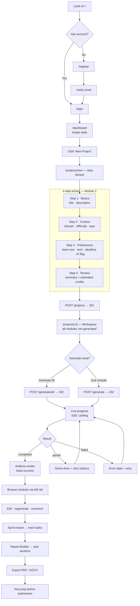
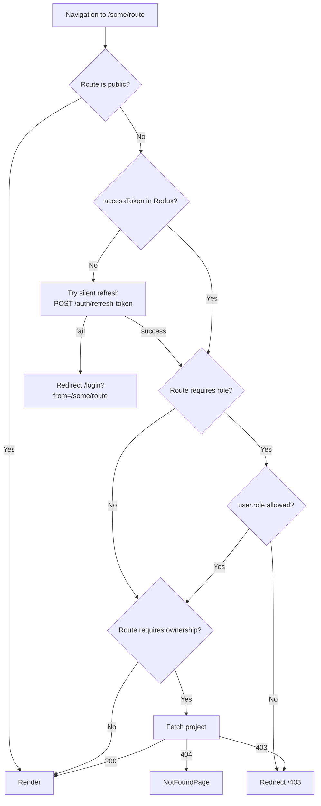
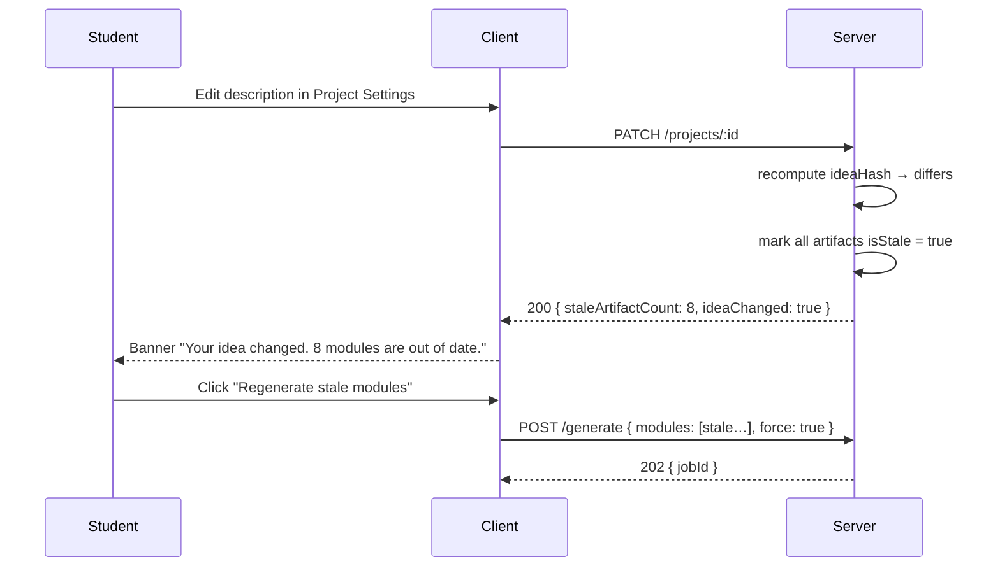
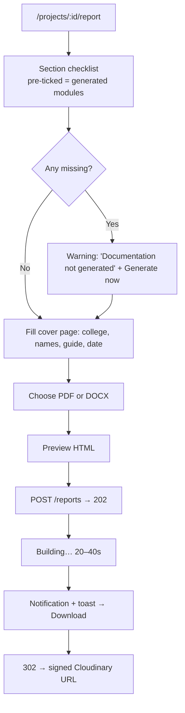

# Projexa — 05. User Flow & Navigation

> **Phase 1 · Document 5 of 7**
> Three roles, 38 routes, four guard types. This document defines what a user sees, in what order, and what the URL is.

---

## 1. Roles & Capabilities

| Capability | Student | Mentor | Admin |
|---|:--:|:--:|:--:|
| Create / edit own projects | ✓ | ✓ | ✓ |
| Generate AI modules | ✓ | ✓ | ✓ |
| Edit generated artifacts | ✓ | — | ✓ |
| Export reports | ✓ | ✓ | ✓ |
| Manage own sprints & tasks | ✓ | — | ✓ |
| View assigned projects (read-only) | — | ✓ | ✓ |
| Comment on any assigned project | — | ✓ | ✓ |
| Resolve comment threads | ✓ | ✓ | ✓ |
| Browse public Explore feed | ✓ | ✓ | ✓ |
| View platform analytics | — | — | ✓ |
| Manage users, roles, credits | — | — | ✓ |
| View AI usage & cost | — | — | ✓ |

A mentor is a **read + comment** role by design. Mentors advise; they never silently rewrite a student's submission, because the student must be able to defend every word at viva.

---

## 2. Primary User Journey — Student, First Session



### 2.1 The Empty-State Decision

A brand-new project shows **all 20 module cards in a 'not generated' state**, not a blank page. Each card names the module, states what it will produce, and has its own Generate button next to a prominent "Generate All" action.

This is deliberate: the product's entire value proposition is the *breadth* of what it produces. Hiding the modules until generation means a first-time user cannot see what they are about to get, and the "Generate All" button becomes an act of faith. Showing the full grid up front makes the value legible in the first three seconds.

### 2.2 Handling the 60–180 Second Generation Wait

This is the highest-risk UX moment in the product. Four mitigations, in order of importance:

1. **Never block.** Generation is a `202` + background job. The user can navigate anywhere, close the tab, and come back — progress is server-side state, not client state.
2. **Per-module streaming.** Modules complete one at a time and render the instant each finishes. The user reads the Overview while the SRS is still generating, so perceived wait ≈ 8 seconds, not 180.
3. **Honest progress.** "Generating 7 of 17 · API Design" with a real percentage. No fake progress bars.
4. **Return path.** A notification and toast fire on completion; if the user left, the sidebar badge and the notification bell bring them back.

---

## 3. Route Map

`client/src/routes/paths.js` holds every one of these strings as a constant. No route string is ever hard-coded in a component.

### 3.1 Public — `MarketingLayout`

| Path | Page | Notes |
|---|---|---|
| `/` | `LandingPage` | Hero, module showcase, live demo project |
| `/explore` | `ExplorePage` | Public projects, filter by domain/difficulty |
| `/explore/:slug` | `PublicProjectPage` | Read-only artifact viewer |
| `/pricing` | `PricingPage` | Credit tiers |
| `/about` · `/privacy` · `/terms` | static | |

### 3.2 Auth — `AuthLayout` + `PublicOnlyRoute`

| Path | Page |
|---|---|
| `/login` | `LoginPage` |
| `/register` | `RegisterPage` |
| `/forgot-password` | `ForgotPasswordPage` |
| `/reset-password/:token` | `ResetPasswordPage` |
| `/verify-email/:token` | `VerifyEmailPage` |

`PublicOnlyRoute` redirects an already-authenticated user to `/dashboard` — landing on a login form while logged in is a small thing that makes an app feel broken.

### 3.3 Dashboard — `DashboardLayout` + `ProtectedRoute`

| Path | Page | Role |
|---|---|---|
| `/dashboard` | `DashboardPage` | any |
| `/projects` | `ProjectsPage` | any |
| `/projects/new` | `NewProjectPage` (Idea Wizard) | any |
| `/bookmarks` | `BookmarksPage` | any |
| `/tasks` | `MyTasksPage` — tasks across all projects | any |
| `/notifications` | `NotificationsPage` | any |
| `/profile` | `ProfilePage` | any |
| `/settings` | `SettingsPage` — account, sessions, preferences, credits | any |

### 3.4 Project Workspace — `ProjectWorkspaceLayout` + `ProtectedRoute` + ownership

| Path | Page | Module |
|---|---|---|
| `/projects/:projectId` | `WorkspaceOverviewPage` | module grid + generation control |
| `/projects/:projectId/module/:type` | `ArtifactPage` | **one page renders all 15 text modules** |
| `/projects/:projectId/diagrams` | `DiagramsPage` | 12, 13 |
| `/projects/:projectId/diagrams/:type` | `DiagramDetailPage` | 12, 13 |
| `/projects/:projectId/sprints` | `SprintsPage` — timeline + Kanban | 9 |
| `/projects/:projectId/report` | `ReportPage` — builder + history | 18 |
| `/projects/:projectId/viva` | `VivaPage` — flashcard mode | 11 |
| `/projects/:projectId/comments` | `CommentsPage` | — |
| `/projects/:projectId/settings` | `ProjectSettingsPage` — edit idea, mentors, visibility, delete | 2 |

`:type` values (kebab-case in URLs): `overview`, `features`, `srs`, `database-design`, `api-design`, `folder-structure`, `ui-plan`, `documentation`, `cost-estimation`, `risk-analysis`, `tech-stack`, `roadmap`, `github-guide`, `deployment-guide`.

**One route for fifteen modules.** `ArtifactPage` reads `:type`, dispatches `fetchArtifact`, and delegates to `rendererRegistry[type]`. Fifteen separate routes and fifteen page files would duplicate the same loading, error, stale, toolbar and comment logic fifteen times — and adding Module 21 would mean editing the router. Here it means adding one renderer file.

### 3.5 Mentor — `RoleRoute(['mentor','admin'])`

| Path | Page |
|---|---|
| `/mentor` | `MentorDashboardPage` — assigned projects, pending reviews |
| `/mentor/projects/:projectId` | `ReviewProjectPage` — read-only artifacts + comment rail |

### 3.6 Admin — `RoleRoute(['admin'])`

| Path | Page |
|---|---|
| `/admin` | `AdminOverviewPage` |
| `/admin/users` | `AdminUsersPage` |
| `/admin/projects` | `AdminProjectsPage` |
| `/admin/ai-usage` | `AdminAiUsagePage` |
| `/admin/logs` | `AdminLogsPage` |

### 3.7 Errors

| Path | Page |
|---|---|
| `/403` | `ForbiddenPage` |
| `*` | `NotFoundPage` |

---

## 4. Route Guard Logic



Two details that matter:

- **`?from=` preserved on redirect.** After login the user lands where they were going, not on a generic dashboard. Losing a deep link on session expiry is a common and avoidable frustration.
- **Ownership is verified server-side, always.** `RoleRoute` and ownership checks in the client are *UX*, not security. Every protected endpoint independently re-checks ownership in its service layer. A client-only guard is a suggestion, not a control.

---

## 5. Navigation Structure

### 5.1 Sidebar — Student

```
┌──────────────────────────┐
│  ◆ Projexa     │
├──────────────────────────┤
│  ⌂  Dashboard            │
│  ▣  My Projects      12  │
│  ✚  New Project          │
│  ☑  My Tasks          7  │
│  ★  Bookmarks            │
│  ⊕  Explore              │
├──────────────────────────┤
│  RECENT PROJECTS         │
│  • Hospital Mgmt      ●  │   ● = generating
│  • E-Learning Portal     │
│  • Smart Agriculture     │
├──────────────────────────┤
│  ⚙  Settings             │
│  ◑  Theme                │
├──────────────────────────┤
│  Credits  187 / 200      │
│  ▰▰▰▰▰▰▰▰▰▱              │
├──────────────────────────┤
│  ◯ Ahad Qureshi     ▾    │
└──────────────────────────┘
```

The credit meter is pinned above the profile because quota exhaustion is the single most confusing failure a user can hit. Showing the balance permanently means a `429` is never a surprise.

### 5.2 Project Workspace Rail

Within a project, a second-level rail replaces generic navigation and groups the 20 modules by SDLC stage — mirroring how the student will actually present the work:

```
◀ Back to Projects
─────────────────────
Hospital Management
▰▰▰▰▰▰▱▱▱▱  62%
─────────────────────
OVERVIEW
  ⊙ Project Overview     ✓
  ⊙ Suggested Features   ✓
  ⊙ Tech Stack           ✓
ANALYSIS
  ⊙ SRS                  ✓
  ⊙ Risk Analysis        ⟳     ⟳ = generating
  ⊙ Cost Estimation      ○     ○ = not generated
DESIGN
  ⊙ Database Design      ✓
  ⊙ API Design           ✓
  ⊙ Folder Structure     ✓
  ⊙ UI Plan              ⚠     ⚠ = stale
  ⊙ Diagrams (ERD/UML)   ✓
PLANNING
  ⊙ Sprint Plan          ✓
  ⊙ Roadmap              ✓
DELIVERY
  ⊙ Documentation        ○
  ⊙ GitHub Guide         ○
  ⊙ Deployment Guide     ○
SUBMISSION
  ⊙ Viva Preparation     ○
  ⊙ Export Report        —
─────────────────────
⚡ Generate All Missing (5)
💬 Comments              3
⚙  Project Settings
```

Four status glyphs — `✓` completed, `⟳` generating, `○` not generated, `⚠` stale — give the whole project state at a glance without opening anything. Grouping by SDLC stage rather than listing 20 flat items also doubles as a teaching device: the sidebar itself shows the student the shape of a software lifecycle.

### 5.3 Topbar

`[☰] Breadcrumb / Path        [🔍 ⌘K search]    [🔔 3]  [◑]  [◯ Avatar ▾]`

Command palette (`⌘K` / `Ctrl+K`) searches projects, modules and tasks, and exposes actions ("Generate SRS", "Export report"). With 38 routes and 20 modules per project, click-depth becomes the main navigation cost; a palette flattens it to one keystroke.

### 5.4 Mobile

Sidebar collapses to a bottom tab bar (`Dashboard · Projects · New · Tasks · Profile`); the workspace rail becomes a horizontally scrollable stage-chip row with a dropdown module picker; the Kanban board switches to a single-column swipeable view.

---

## 6. Key Secondary Flows

### 6.1 Idea Change → Stale Artifacts



Old content stays visible and readable the entire time. Nothing is deleted until a replacement has successfully generated — if the regeneration fails, the student still has their previous SRS the night before submission.

### 6.2 Mentor Review

```mermaid
flowchart LR
    A["Student: Project Settings → Invite mentor by email"] --> B["POST /projects/:id/mentors"]
    B --> C["Mentor receives notification + email"]
    C --> D["Mentor: /mentor dashboard"]
    D --> E["Open /mentor/projects/:id — read-only"]
    E --> F["Comment on a specific module"]
    F --> G["Student notified"]
    G --> H["Student revises or regenerates"]
    H --> I["Either party resolves the thread"]
```



### 6.3 Report Export



### 6.4 Session Expiry

Access token expires → the next request returns `401` → the Axios interceptor silently refreshes → the request replays → **the user notices nothing**. Only if the refresh token is also expired or revoked does the store clear, a toast appear ("Session expired, please sign in"), and the app redirect to `/login?from=<current path>`.

---

## 7. Loading, Empty & Error States

Specified per surface up front, because these are what separate a project that looks finished from one that looks like a prototype.

| Surface | Loading | Empty | Error |
|---|---|---|---|
| Dashboard | Skeleton stat cards + card grid | "No projects yet" + illustration + primary CTA | Retry banner |
| Projects list | 6 skeleton cards | Filter-aware: "No projects match these filters" + Clear | Retry |
| Artifact page | Shimmer blocks shaped like the real content | "Not generated yet" + Generate button + one-line description of what it produces | Error card + Retry + "Report issue" |
| Generation | Per-module progress with live status | — | Per-module retry; batch is never lost |
| Sprint board | Skeleton columns | "No sprints yet" + Generate sprint plan | Retry |
| Report | Progress with stage label | "No reports yet" | Missing-sections list, not a generic failure |
| Explore | Skeleton grid | "No public projects yet" | Retry |
| Notifications | Skeleton rows | "You're all caught up" | Retry |

**Skeletons are shaped like the content they replace**, not generic grey bars. A skeleton that matches the final layout eliminates the layout shift that makes a page feel unstable when data lands.

---

## 8. Accessibility Baseline

| Requirement | Implementation |
|---|---|
| Keyboard navigation | Every interactive element reachable; visible focus ring (`focus-visible:ring-2`) |
| Modals | Focus trap, `Esc` to close, focus returned to the trigger |
| Contrast | WCAG AA (4.5:1 text, 3:1 UI) — verified in Doc 06's palette |
| Screen readers | Semantic landmarks, `aria-live="polite"` on the generation progress region |
| Status is never colour-only | Every status glyph pairs an icon with a text label |
| Motion | All Framer Motion animations respect `prefers-reduced-motion` |
| Forms | Every input has a `<label>`; errors linked via `aria-describedby` |
| Skip link | "Skip to main content" as the first tab stop |

---

**Previous:** [04 — API Specification](./04-api-specification.md) · **Next:** [06 — Dashboard & Design System](./06-dashboard-and-design-system.md)
